```python
%pylab inline
```

```python
import torch
from torch import nn
from torchmore import layers, flex
```


# SEMANTIC SEGMENTATION


# Task

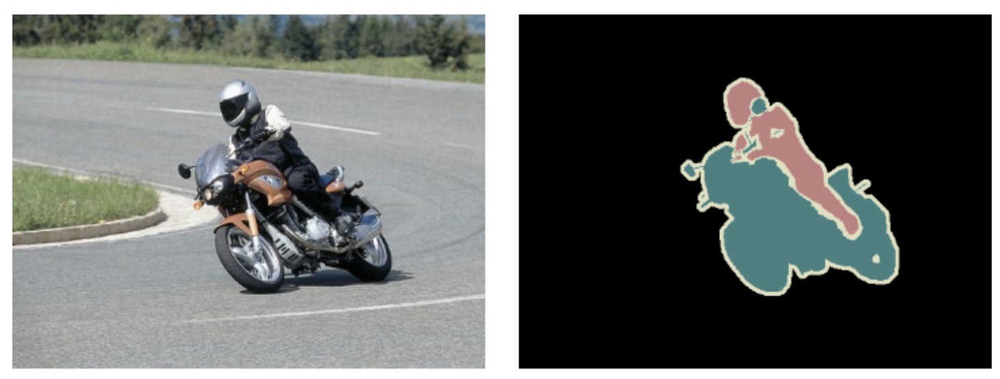


# Footprints

What information can be taken into account in making segmentation decisions?

**Convolutional Architectures** $2^k \cdot r$ with $k$ = number of max-pooling layers and $r$ footprint of the convolutions

**MD-LSTM Architectures** Unlimited / global.

Consequence:

- may need very deep networks to take whole page information into account with convolutional architectures
- even then, precise geometry is difficult to keep track of across the whole page


# MD-LSTM

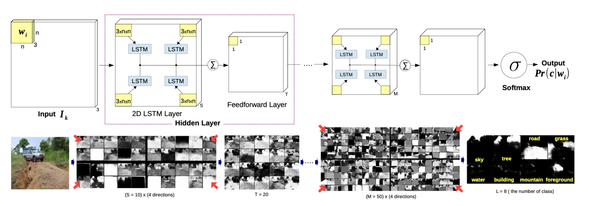

Byeon, Wonmin, and Thomas M. Breuel. "Supervised texture segmentation using 2D LSTM networks." 2014 IEEE International Conference on Image Processing (ICIP). IEEE, 2014.

Byeon, Wonmin, et al. "Scene labeling with lstm recurrent neural networks." Proceedings of the IEEE Conference on Computer Vision and Pattern Recognition. 2015.


# Fully Convolutional Networks

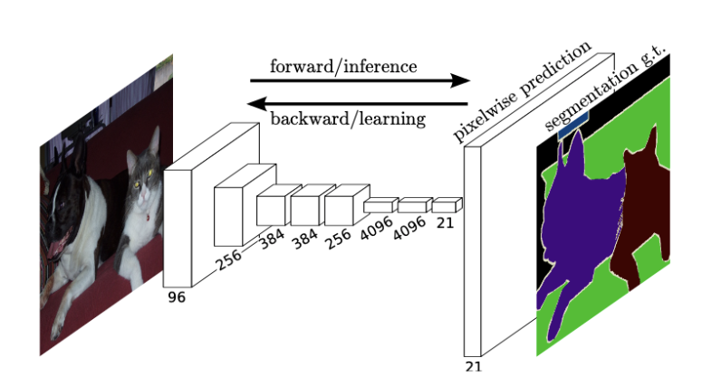

Long, Jonathan, Evan Shelhamer, and Trevor Darrell. "Fully convolutional networks for semantic segmentation." Proceedings of the IEEE conference on computer vision and pattern recognition. 2015.


# Transposed Convolution

("Deconvolutional")

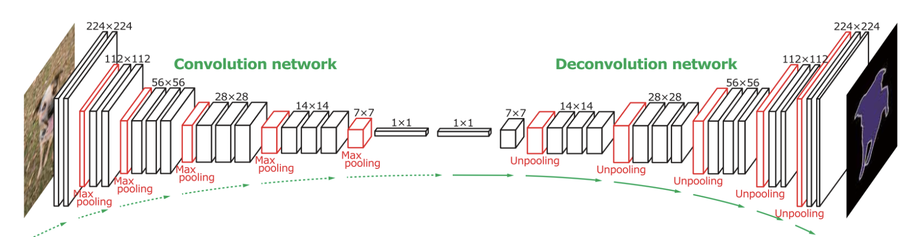

Noh, Hyeonwoo, Seunghoon Hong, and Bohyung Han. "Learning deconvolution network for semantic segmentation." Proceedings of the IEEE international conference on computer vision. 2015.


# U-Net

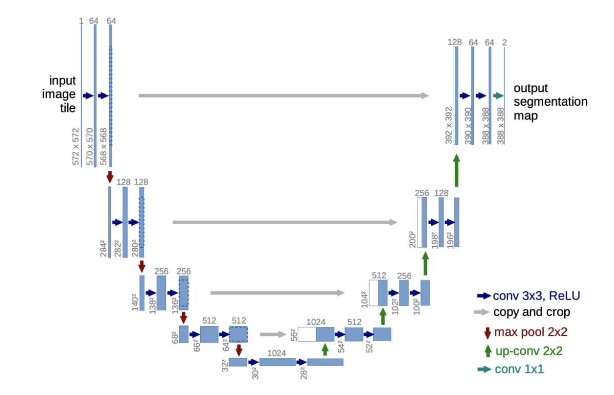

Ronneberger, Olaf, Philipp Fischer, and Thomas Brox. "U-net: Convolutional networks for biomedical image segmentation." International Conference on Medical image computing and computer-assisted intervention. Springer, Cham, 2015.


# Dilated Convolutions

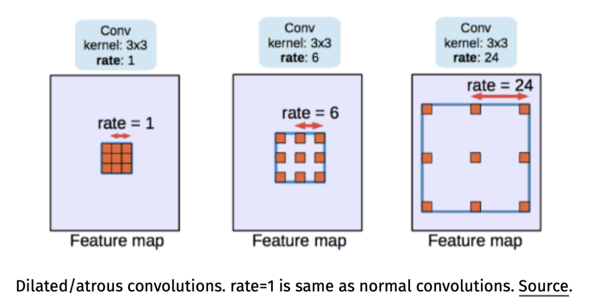

Chen, Liang-Chieh, et al. "Deeplab: Semantic image segmentation with deep convolutional nets, atrous convolution, and fully connected crfs." IEEE transactions on pattern analysis and machine intelligence 40.4 (2017): 834-848.


# LAYOUT MODELS


# Layout Analysis

Goals of document layout analysis:

- identify text/image regions on pages
- find text lines
- find words within text lines
- determine reading order


# Document Segmentation

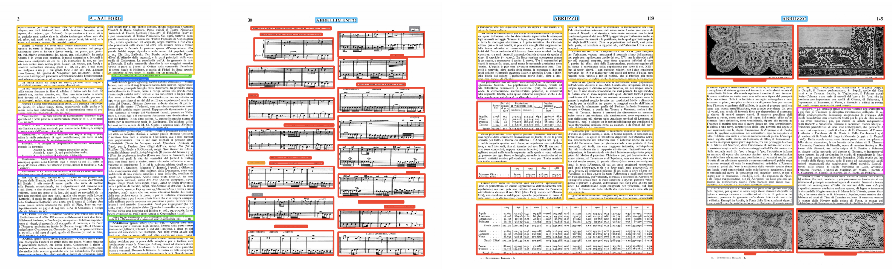

Corbelli, Andrea, et al. "Historical document digitization through layout analysis and deep content classification." 2016 23rd International Conference on Pattern Recognition (ICPR). IEEE, 2016.

# Historical Layout Analysis

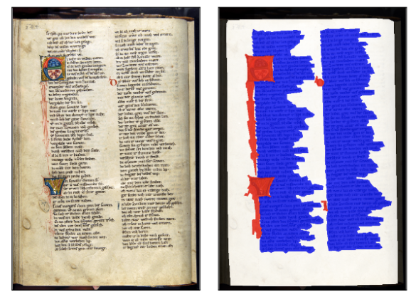

Chen, Kai, et al. "Convolutional neural networks for page segmentation of historical document images." 2017 14th IAPR International Conference on Document Analysis and Recognition (ICDAR). Vol. 1. IEEE, 2017.


# RCNN for Layout Analysis

- RCNN has been used for word bounding boxes in scene text
- likely does not work well for whole page segmentation
  - regions often not exactly axis-aligned rectangles
  - regions wildly differ in scale and shape
  - region hypotheses likely difficult to regress from moving windows
  
Jaderberg, Max, et al. "Reading text in the wild with convolutional neural networks." International Journal of Computer Vision 116.1 (2016): 1-20.

# Layout Analysis as Semantic Segmentation

- semantic image segmentation = image-to-image transformation
- each image is classified into one of several different semantic classes
- possible pixel classes for layout analysis:
  - text / image / table / figure / background
  - baseline / background
  - centerline / background
  - text / image / text line separator / column separator


# What do we label?

Possibilities:

- foreground pixels only
- all pixels in a rectangle / region
- leave it up to the algorithm

Very different results:

- foreground/algorithm = we don't know which pixels belong together
- all pixels in a region = group pixels together by connected components

Choice depends on post-processing.


# Page Level Segmentation

Page level segmentation divides images into text regions, image regions, and background.

- precise pixel-level segmentations are not usually needed
- segmentations can be computed at a lower level of resolution
- simple properties like text/image/background can be computed based on local texture / statistics
- separating adjacent text columns or images may be difficult, since background gaps may be narrow


# Page Level Segmentation

Different uses:

- simply mask out non-text regions for further processing (basic binary map sufficient)
- extract text regions via connected components (requires higher quality segmentation)


# Layout Tasks

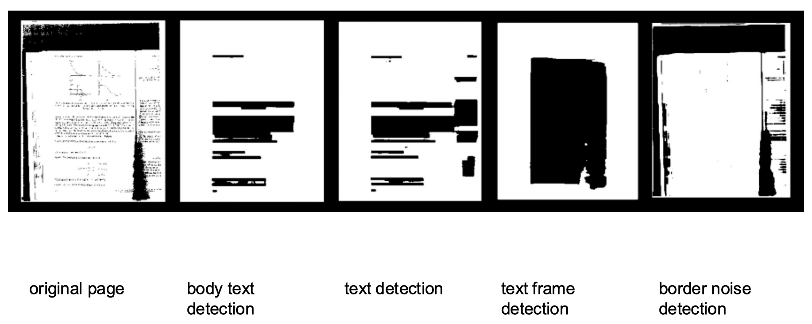


# Simple Approach

Word segmentation:

- assume training data consists of page images and word bounding boxes
- create a binary target that is 1 inside word bounding boxes and 0 elsewhere
- learn an image-to-image model predicting the binary map from the input document image

Problem:

- word bounding boxes are often overlapping
- how do we turn the resulting binary image into something we can feed to a word recognizer?


# Centerline / Baseline Approach

Word/line segmentation:

- assume training data consists of page images and word/line bounding boxes
- create a binary image that marks either the center line or the baseline of each bounding box
- learn an image-to-image model predicting the centerline/baseline map from the input document image:

Properties:

- works better than the simple approach
- still need to use non-DL mechanisms to find the word/line bounding boxes from the seeds


# Line Marker Learning

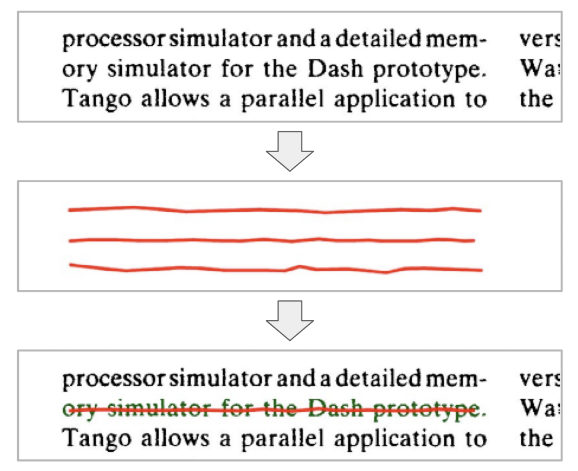


# Marker Plus Separator Approach

Word/line segmentation:

- assume training data consists of page images and word/line bounding boxes
- three output classes:
  - background
  - marker (center of bounding box)
  - boundary (outline of bounding box)
- train image-to-image segmentation model to output all three classes
- recover word/line images via marker morphology

Properties:

- functions like RCNN, in that it finds both the location and the size of object instances (words/lines)
- simpler to understand/tune: we can see the marker/boundary proposals


# Marker-plus-Separator

<table>
    <tr>
        <td>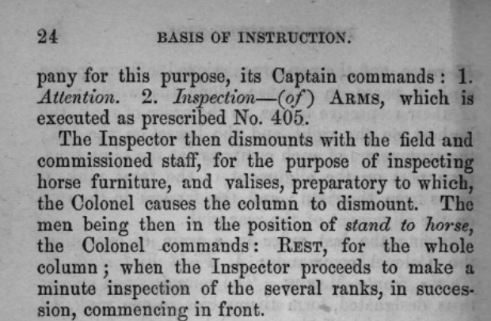</td>
        <td>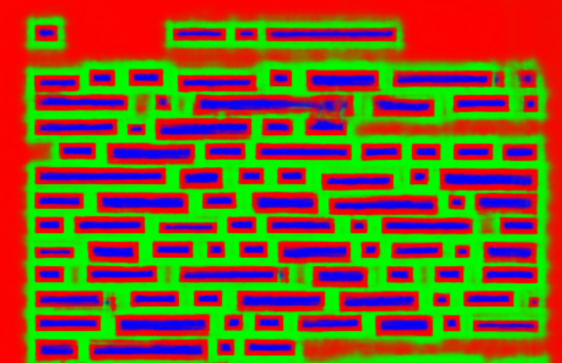</td>
    </tr>
</table>

# Word Segmentation

<table>
    <tr>
        <td>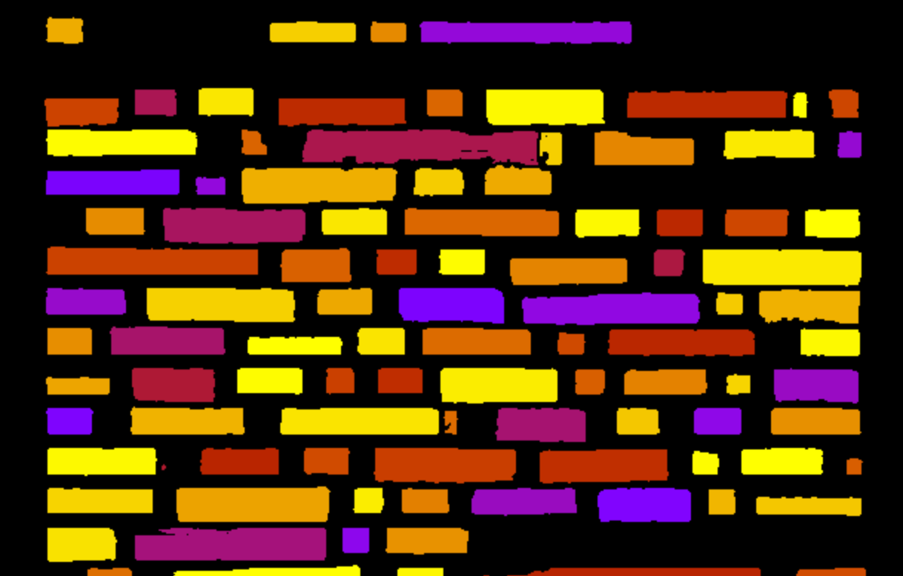</td>
        <td>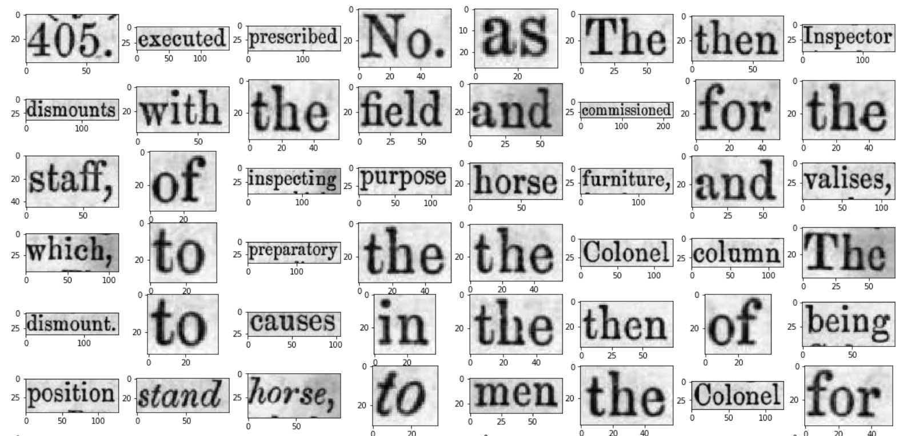</td>
    </tr>
</table>


# Semantic Segmentation into Blocks

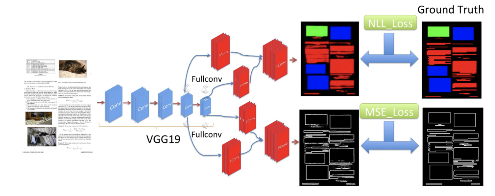

He, Dafang, et al. "Multi-scale multi-task fcn for semantic page segmentation and table detection." 2017 14th IAPR International Conference on Document Analysis and Recognition (ICDAR). Vol. 1. IEEE, 2017. (Also uses CRFs.)


# Layout Analysis as Semantic Segmentation

- formulate layout analysis as assigning labels to each pixel
- many possible labeling schemes depending on available training data and post-processing
- main decisions:
    - label centers, boxes, foreground pixels, markers
    - label separators in addition to objects


# Layout Analysis with U-Net (PyTorch)

```python
from torch import nn
class UnetLayer(nn.Module):
    def __init__(self, d, r=3, sub=None):
        super().__init__()
        self.down = nn.MaxPool2d(2)
        self.up = flex.ConvTranspose2d(d, r, stride=2, padding=1, output_padding=1)
        self.sub = sub
    def forward(self, x):
        lo = self.down(x)
        out = self.sub(lo)
        hi = self.up(out)
        result = torch.cat([x, hi], dim=1)
        return result
```

```python
def make_seg_unet(noutput=3):
    model = nn.Sequential(
        layers.Input("BHWD", reorder="BDHW", range=(0, 1), sizes=[None, 1, None, None]),
        *conv2d(64, 3, repeat=3),
        UnetLayer(64, sub=[
            *conv2d(128, 3, repeat=3),
            UnetLayer(128, sub=[
                *conv2d(256, 3, repeat=3),
                UnetLayer(256, sub=[
                    *conv2d(512, 3, repeat=3),
                ])
            ])
        ]),
        *conv2d(64, 3, repeat=2),
        flex.Conv2d(noutput, 5))
```

# Layout Analysis with MDLSTM (PyTorch)

```python
def make_seg_lstm(noutput=3):
    model = nn.Sequential(
        layers.Input("BHWD", reorder="BDHW", range=(0, 1), sizes=[None, 1, None, None]),
        *conv2mp(50, 3, 2, repeat=3),
        *conv2mp(100, 3, 2, repeat=3),
        flex.Lstm2(200)
        *conv2d(400, 5),
        flex.Conv2d(noutput, 1)
    )
    flex.shape_inference(model, (1, 256, 256, 1))
    return model
```

# Semi-Supervised and Weakly Supervised Approaches

Problem:

- getting training data for layout analysis is difficult
- manual markup is a lot of work

Solution:

- text-only / image-only data is easy to get
- text regions can be verified via OCR
- approach similar to RCNN: generate lots of text boxes and verify
- soft labels, taking advantage of posterior probability estimates


```python

```
