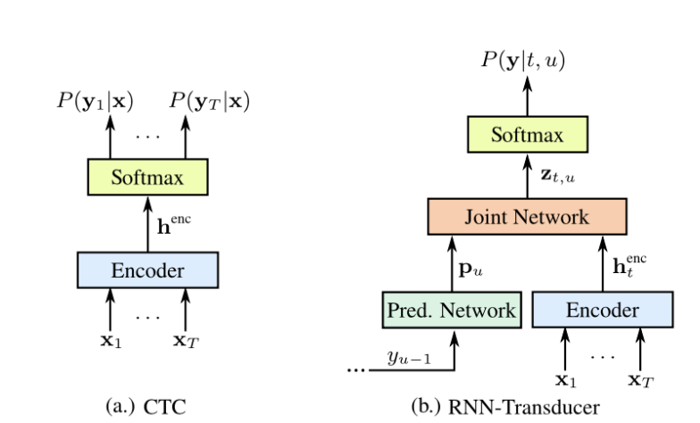
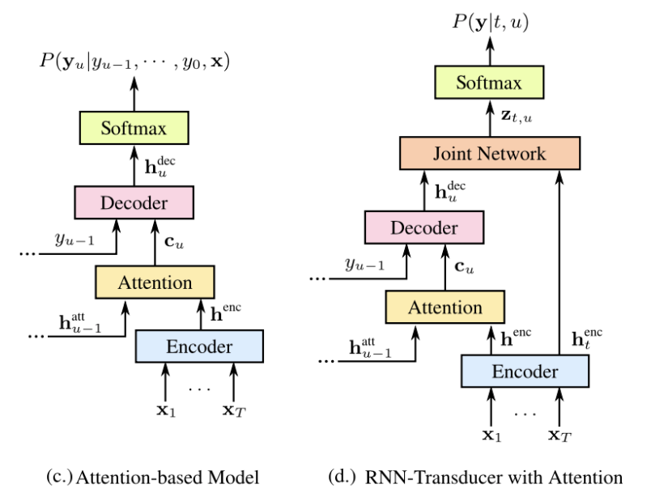
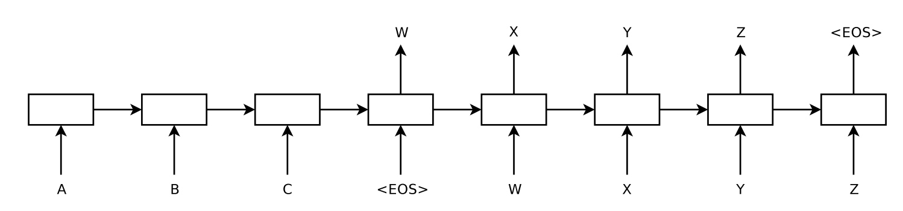
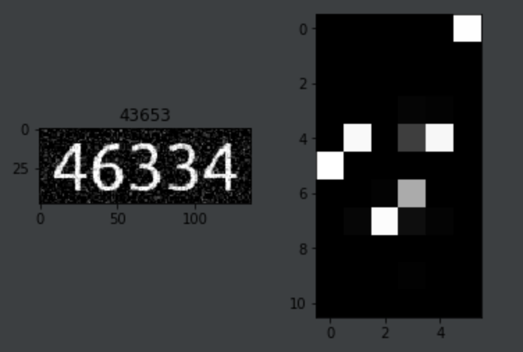
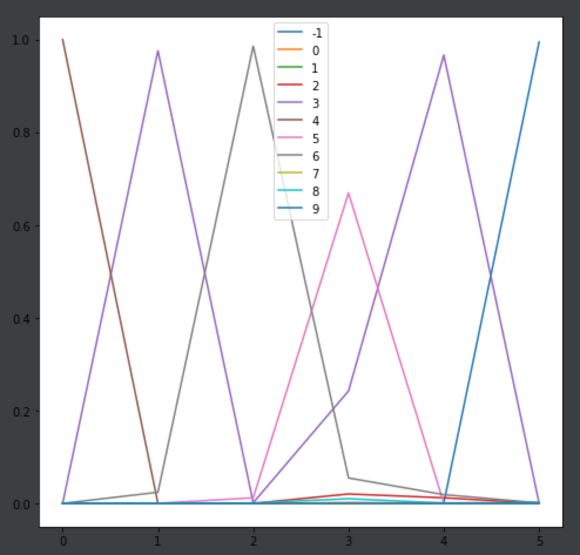

```python
%pylab inline
```

```python
import torch
from torch import nn
from torchmore import layers, flex
```


# MOTIVATION


# Sequence to Sequence Models

- recognition: sequence of feature vectors to outputs (e.g., OCR, handwriting, speech)
- improving / correcting OCR output via language models (discarding unlikely hypotheses)
- reading order determination (which text line follows which other text line)
- ground truth alignment and semi-supervised training
- semi-supervised training


# CLASSICAL THEORY

# Languages

- _languages_ are sets of strings $L\subseteq\Sigma^*$ over some alphabet $\Sigma$
- alphabets are commonly either _characters_ or _words_
- language come in different classes (Chomsky hierarchy):
    - regular languages = finite automaton
    - context free languages = pushdown automaton
    - context dependent languages = linear bounded automaton
    - recursively enumerable = Turing machine


# Statistical Language Models

- statistical language models assign probabilities to strings
- $P(\hbox{Dog bites man.}) > P(\hbox{Man bites dog.}) > P(\hbox{Bites man dog.})$
- statistical language models are used to correct ambiguous OCR / speech results
- statistical language models include prior information about language

OCR: "The ca? drives down the road." ? = r or n

Correct: "The car drives down the road."


# "Classical" Statistical Language Models

- $n$-gram models with smoothing
- either in terms of characters or words
- statistical version of regular languages
- do not capture context, semantics, or other phenomena

$P(\hbox{next character} | \hbox{previous characters})$

E.g.,

$$P(c | \hbox{"neur"}) = ...$$

High for $c \in \{"a", "o"\}$, low for $c \in \{"t", "x"\}$


# $n$-Grams

For $n$-gram models, we simply tabulate $P(s_n | s_{s-1} ... s_{s-n})$ for all valid strings $s$.

```python
from collections import Counter
import re
training_set = [ s.strip().lower() for s in open("/usr/share/dict/words").readlines()]
training_set = [ s for s in training_set if not re.search(r"[^a-z]", s)]
print(len(training_set))
print(training_set[:10])
```

```python
n = 3
suffixes, ngrams = Counter(), Counter()
for s in training_set:
    s = "_"*n + s
    for i in range(n, len(s)):
        suffixes[s[i-n:i-1]] += 1
        ngrams[s[i-n:i]] += 1
```

Now we can estimate probabilities easily:

```python
def prob(s):
    return ngrams[s] / float(suffixes[s[:-1]])

probabilities = sorted([(prob("aa"+chr(i)), "aa"+chr(i)) for i in range(ord("a"), ord("a")+26)], reverse=True)
probabilities[:10]
```

# OCR / SPEECH RECOGNITION


# Classical OCR / Speech Recognition

- segment the input image into a sequence of character images $x_i$
- classify each character with a neural network giving posterior probabilities $P(s_i | x_i)$
- combine the posterior probabilities with a language model (e.g., $n$-gram)

Under some assumptions, the optimal solution is given by:

$$D(x) = \arg\max_s P(s) \prod P(s_i | x_i)$$

$P(s)$: language model, $P(s_i | x_i)$: "acoustic" model


# First Neural Network Models for OCR / Speech

Basis:

- acoustic model: $P(s_i | x_i)$
    - single character neural network model or scanning neural network model (e.g., LeCun 1995)
- language model: $P(s)$
    - $n$-gram language model:  $\prod P(s_i | s_{i-1}...s_{i-n} )$


  

# First Neural Network Models for OCR / Speech

Complications:

- multiple alternative segmentations of the input
    - requires maximizing over segmentations $S$
    - $D(x) = \arg\max_{s,S} P(S) P(s)\prod P(s_i|x_i, S)$
    - requires complicated dynamic programming algorithm to solve
- language model smoothing


# HMM Models for OCR / Speech

- treat OCR/Speech as a sequence to sequence model
- usually continuous for better performance, but think of it with VQ:
    - speech: compute windowed FT and perform $k$-means clustering
    - OCR: take vertical slices through the input image and perform $k$-means clustering
- now have sequence to sequence problem:
    - input: sequence of cluster center identifiers $1...k$
    - output: sequence of characters / words


# Recurrent Neural Networks

- feature vector sequence to output string is a sequence-to-sequence transformation
- we can learn this directly with recurrent neural networks
- example models:
    - TDNN (time delayed neural networks)
    - simple recurrent neural networks
    - LSTM and GRU networks


# Sequence to Sequence Models

- TDNN, recurrent, and LSTM networks are limited
    - similar to HMM models / regular languages
    - can take into account contextual information for probabilities
    - provide black-box input-to-output mappings
- machine translation and similar tasks require...
    - movements and inversions of strings
    - recognition lattices that can be processed further
    - sequence-to-sequence models fill this gap


# Recurrent Models, LSTM+CTC

- already covered in previous slides
- note that the "CTC" portion of LSTM training is the same algorithm as the forward-backward algorithm used in HMM training


# Simple Convolutional Models

- we can replace the probability estimates $P(s_i | s_{i-1}...s_{i-n})$ with neural network estimates
- these are simple convolutional models
    - replace the character/word sequence with a sequence of one-hot encoded character/word vectors
    - consider a context of length $n-1$ and an alphabet of size $r$
    - now $P(s_i | s_{i-1}...s_{i-n})$ can be modeled by a network that maps a $n-1 \times r$ input to $r$ probabilities
    - this can be either a fully connected network or even a convolutional network
- like $n$-grams, these models have a finite history
- we can simply treat them as smoothed probability estimates if they are causal
    


# Grave's Neural Transducer

Reasoning:

- LSTM+CTC only contains "acoustic model", no language model
- for the language model, we need current output conditioned on actual previous outputs
- encoder: bidirectional LSTM operating over input
- prediction network: forward LSTM predicting $s_i$ given $s_{i-1}...s_0$
- mirrors the dynamic programming / beam search used with HMMs + language models


# Graves's Neural Transducer


# Graves's Neural Transducer



Figure: Prabhavalkar, Rohit, et al. "A Comparison of Sequence-to-Sequence Models for Speech Recognition." Interspeech. 2017.


# Bahdanau Attention



Chorowski, Jan, et al. "End-to-end continuous speech recognition using attention-based recurrent nn: First results." arXiv preprint arXiv:1412.1602 (2014).

Figure: Prabhavalkar, Rohit, et al. "A Comparison of Sequence-to-Sequence Models for Speech Recognition." Interspeech. 2017.


# Sequence to Sequence



Sutskever, Ilya, Oriol Vinyals, and Quoc V. Le. "Sequence to sequence learning with neural networks." Advances in neural information processing systems. 2014.


# SEQ2SEQ FOR DIGIT RECOGNITION

```python
from torch import nn
class Seq2Seq(nn.Module):
    def __init__(self, ninput, noutput, nhidden, pre=None, nlayers=1):
        super().__init__()
        self.encoder = nn.LSTM(ninput, nhidden, num_layers=nlayers)
        self.decoder = nn.LSTM(noutput, nhidden, num_layers=nlayers)
        self.out = nn.Linear(nhidden, noutput)
        self.logsoftmax = nn.LogSoftmax(dim=0)
```

For a seq2seq model, we need an encoder, a decoder, and an output map

```python
def forward(self, inputs, target, forcing=0.5):
    _, state = self.encoder(inputs)
    for i in range(len(targets)):
        decoder_output, state = self.decoder(decoder_input.view(1, 1, -1), state)
        _, pred = self.logsoftmax(self.out(decoder_output)[0, 0]).topk(1)
        decoder_input = hotone(pred)
```

```python
def greedy_predict(self, inputs):
    _, state = self.encoder(inputs)
    result = []
    for i in range(MAXLEN):
        decoder_output, state = self.decoder(decoder_input.view(1, 1, -1), state)
        _, pred = self.logsoftmax(self.out(decoder_output)[0, 0]).topk(1)
        decoder_input = hotone(pred)
        result.append(pred)
        if pred==0: break
    return result
```

# Sequence-to-Sequence Output

<table>
    <tr>
        <td></td>
        <td></td>
    </tr>
</table>


# Summary: Sequence to Sequence

- in addition to LSTM+CTC, there are more complex sequence-to-sequence architectures
- such architectures explicitly model dependencies within the output
- they also allow inputs/outputs of very different lengths and rearrangements of sequence elements

Useful applications:

- potential seq2seq OCR applications (some found in the literature)
- general purpose language modeling and OCR correction
