# FOUNDATIONS

---

# Original Convolutional Networks

"Convolutional Networks for Image, Speech, and Time Series", Yann LeCun and Yoshua Bengio, 1995

- convolutional layers
- sigmoid non-linearities
- gradient descent training
- scanning for multi-object localization

---

# Architecture

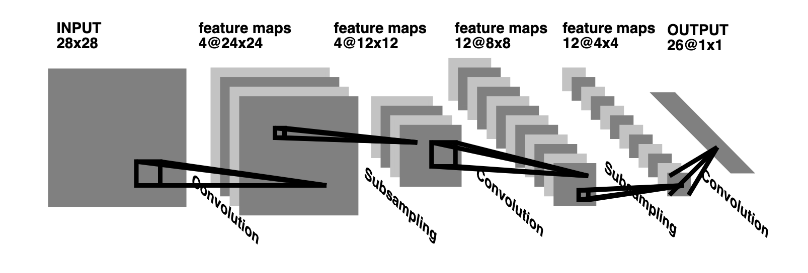

---

# Application to Handwriting

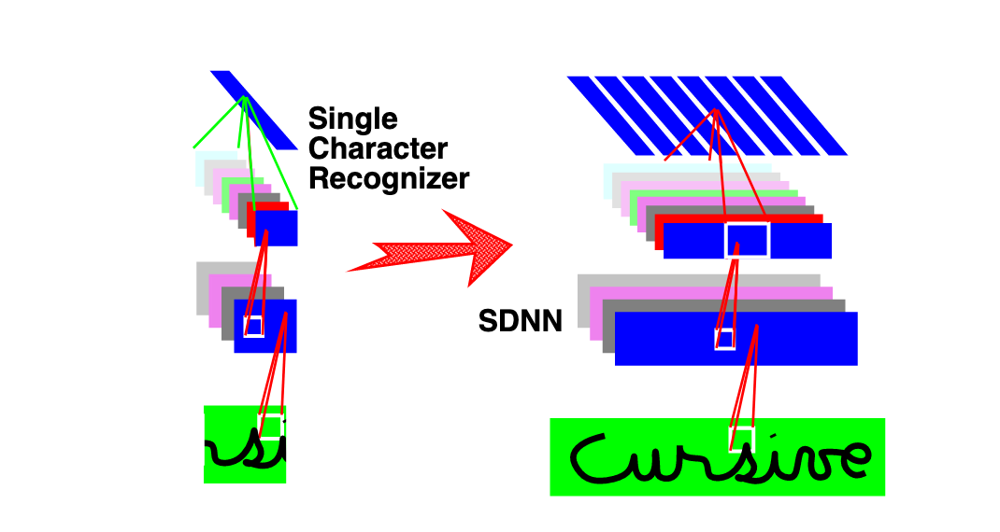

---

# PyTorch Equivalent

    nn.Sequential(
        layers.Input("BDHW", size=(None, 1, 28, 28)),
        flex.Conv2d(4, 5),
        nn.Sigmoid(),
        nn.AvgPool(2),
        flex.Conv2d(12, 5),
        nn.Sigmoid(),
        nn.AvgPool(2),
        layers.Reshape(0, [1, 2, 3]),
        flex.Linear(26)
    )

---

# Function Approximation View

- neural networks are function approximators
- multilayer neural networks with sigmoids are _universal approximators_
- that is: if large enough, they can approximate any function arbitrarily well

---

# Pattern Recognition View

- given a measurement vector $x$, find a decision function $D: x \rightarrow \omega$
- that decision function is the _classifier_
- $D$ is a function mapping real vectors to discrete values; those are hard to approximate
- instead, approximate _discriminant functions_ such that $D(x) =\arg\max_\omega f(x)$
- the larger $f_\omega(x)$, the more $x$ "belongs to" class $\omega$

---

# Neural Networks and Classification

- use deep neural networks as function approximators
- approximate discriminant functions using the network
- classify based on those approximations

---

# Bayesian Decision Theory

- classification problems: joint densities of measurements and class labels $P(x, \omega)$
    - class conditional density: $P(x | \omega)$
    - posterior probability: $P(\omega | x)$
    - Bayes rule: $P(\omega | x) = P(x | \omega) P(\omega) / P(x)$
- want to minimize the probability of prediction error
- this is accomplished by choosing $D(x) = \arg\max_\omega P(\omega | x)$
- this decision rule is Bayes optimal: no other rule can give better performance

---

# Neural Networks and Posteriors

When you train a regression function against training samples with 0/1 outputs (based on class membership), you approximate the posterior probability distribution.

Therefore:
- set up a neural network as a universal approximator $y = f_\theta(x)$
- convert each class label to a one-hot encoding
- perform least square approximation of $y_i^{(k)} = f_\theta(x^{(k)})$
  for all training samples $x^{(k)}, y^{(k)}$
- use the estimate $\tilde{\theta}$ to make decisions, as in
  - $y = f_{\tilde{\theta}}(x)$
  - $\tilde{P}(\omega | x) = y_\omega$
  - $D(x) = \arg\max_\omega \tilde{P}(\omega | x)$

---

# Model Selection and Regularization

- we can choose many different kinds of models $f_\theta$, $\theta\in\mathbb{R}^d$
  - small $d$: good predictions, but batch match to the data
  - large $d$: bad predictions, but good match to the data
- "bias/variance tradeoff", VC-dimension, empirical risk
- general approaches to dealing with this:
  - cross validation, early stopping
  - regularization by imposing costs on $\theta$
  - model selection
- traditional view: "neural networks have too many parameters to generalize well"

---

# Linear Layers

$y = M\cdot x + b$ -- pure linear regression

$y = \sigma(M\cdot x+b)$ -- logistic regression

$y = H(M \cdot x + b)$ -- linear decision boundaries ($H(x) = \left\lfloor x > 0 \right\rfloor$)

---

# Theory of Linear Classifiers

- functionally equivalent to nearest neighbor classifiers with a single prototype each
- Bayes-optimal classifier for many classification problems with class-independent noise
- can be extended to non-linear classification problems by data transformation
- e.g. quadratic augmentation:
    $x \rightarrow (1, x_1,...,x_n, x_1x_1, x_1x_2, ... x_ix_j ..., x_nx_n)$
- quadratic classifier sufficient for all classification problems with normal c.c.d.'s

---

# Two Linear Layers

    nn.Sequential(
        nn.Linear(n0, n1),
        nn.Sigmoid(),
        nn.Linear(n1, n2),
        nn.Sigmoid()
    )

- equivalent to RBF layer or prototype-based classification
- universal approximator

---

# Composition of Layers

    nn.Sequential(nn.Linear(n0, n1), nn.Linear(n1, n2))

This is effectively the same as `nn.Sequential(nn.Linear(n0, n2))`

---

# Scale Factors and Composition

    nn.Sequential(nn.Linear(n0, n1), nn.Sigmoid(), Fun(lambda x: scale*x), nn.Linear(n1, n2))

- the scale factor can usually be incorporated into the second linear layer
- the possibility of scaling means that the sigmoid can operate in its exponential, linear, or logarithmic regime
- this analysis changes, however, for ReLU and batch normalization

---

# Linear Layer vs RBF

Consider single output from linear layer:

$y = m \cdot x + b$

Compare:

$y = ||x - \mu||^2 = ||x||^2 - 2 \mu \cdot x + ||\mu||^2$

Assume normalized inputs $||x||=1$,

$y = -2 \mu \cdot x + ||\mu||^2 + 1 = m \cdot x + b$

for

$m = -2 \mu$ and $b = ||\mu||^2 + 1$

---

# Linear Layer vs RBF, VQ

- A linear layer taking (approximately) normalized inputs effectively computes the distance of each input from a prototype and then outputs the distance as its activation.
- When such an output is passed through a sigmoid, it can approximate Gaussian RBFs or other RBF kernels.
- When used with an exponential nonlinearity or softmax, this can make a layer operate like a vector quantizer.

---

# Linear Layers vs PCA/ICA

    nn.Linear(n1, n2)

If $n_2 < n_1$, this may be performing PCA (principal component analysis) or ICA (independent component analysis

PCA is related to the autoencoder:

    nn.Sequential(nn.Linear(n1, n2), nn.Linear(n2, n1))

PCA attempts to remove noise components while maintaining relevant components.

---

# Summary of Linear Layers

Linear Layers can compute:

- PCA
- ICA
- RBF
- VQ

Which they compute depends on the loss/objective functions, input normalization, training data, and dimensionalities involved.

---

# Convolutional Layers

    nn.Conv2d(ninputs, noutputs, window_size)

Convolutional layers are:
- linear layers
- taking a small window as input
- sliding over the input image

---

# "Network in Network"

- Paper that claimed substantial improvements in performance by replacing convolutions with a multi-layer network.
- In practice, scanning a multilayer network is equivalent to an $n\times n$ convolution followed by $1 \times 1$ convolutions.

        nn.Sequential(
            flex.Conv2d(64, (11, 11)),
            nn.Sigmoid(),
            flex.Conv2d(128, (1, 1)),
            nn.Sigmoid()
        )

---

# Convolutions as Matched Filters

- recall above that linear layers compute "distance from prototype"
- for convolutional layers, this means "distance from prototype" over sliding window
  - given a target pattern
  - slide the target pattern over the entire window
  - compute how well the target pattern matches at each location
  - put the score for that match into the corresponding output channel
- this is called a "matched filter" in signal processing

---

# Convolutions for Image Processing

- image processing = image to image transformations
- rich theory of linear and non-linear image processing
- image processing usually seeks to:
  - remove noise
  - correct color
  - enhance features of interest

---

# Convolutions for Image Processing

- theory of linear, shift-invariant filters
- closely tied to frequency domain/Fourier analysis
- closely tied to MSE/L2 error models, least square matching
- linear analysis applies to sigmoids in linear domain
- directly carries over:
  - separability (used in Inception)
  - Fourier transform layers (available in PyTorch)

---

# Average Pooling and Sampling

- average pooling is:
  - filter (pillbox filter) combined with
  - subsampling
- rich theory:
  - sampling theorem
  - aliasing theorems

---

# Feature Hierarchies

- LeCun: "this creates a feature hierarchy"
- feature hierarchies motivated by
  - theoretical limitations of shallow networks
  - observations of neural activity and processing stages in animals

---

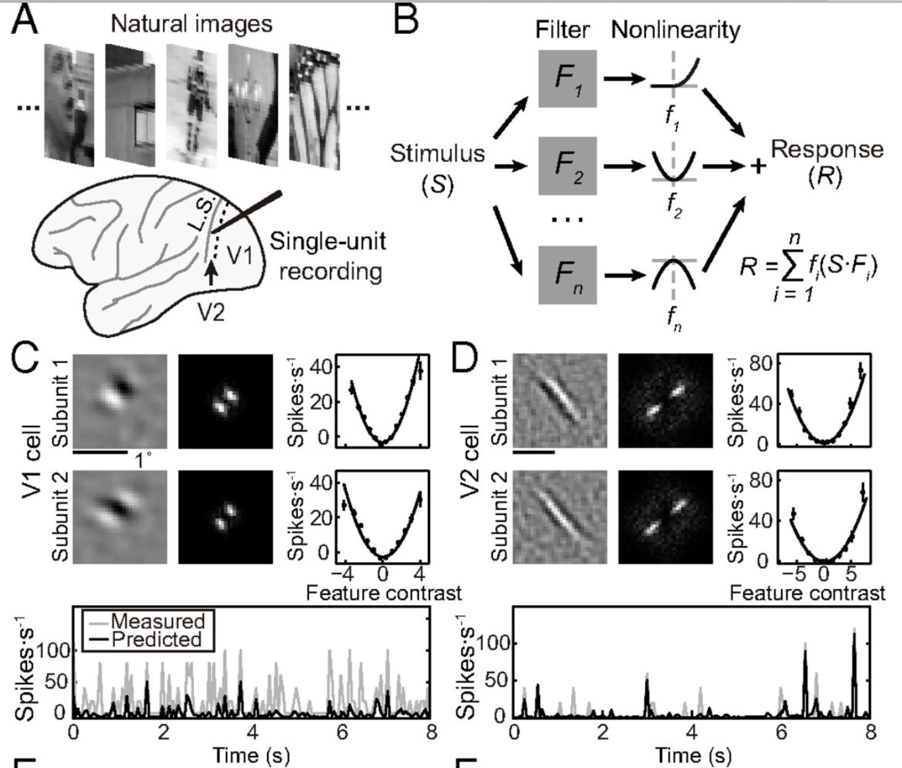

---

# Feature Hierarchies

- convolutional layers stacked on top of each other
- intended to recognize more and more complex visual concepts:
  - simple local intensity changes
  - extended edges
  - corners
  - groupings of corners
  - entire objects
- little sound theoretical foundation

---

# MODERN DEEP LEARNING ERA

---

# Breakthrough Paper

"ImageNet Classification with Deep Convolutional Neural Networks", Alex Krizhevsky, Ilya Sutskever, Geoffrey E. Hinton, 2013

- substantially better performance on image recognition than non-neural approaches
- effective use of GPUs for convolutional neural networks
- ReLU nonlinearity
- max pooling
- data augmentation
- dropout, local response normalization
- much bigger than previous networks

None of these were new ideas, but this paper brought it all together.

---

# Alexnet Architecture

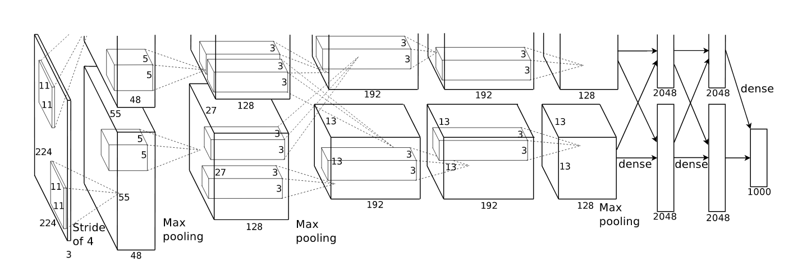

---

# Alexnet Architecture (approximately)

    nn.Sequential(
        layers.Input("BDHW", size=(None, 3, 224, 224)),
        flex.Conv2d(2*48, (11, 11)),
        nn.ReLU(),
        nn.MaxPool2d((2, 2)),
        flex.Conv2d(2*192, (3, 3)),
        nn.ReLU(),
        flex.Conv2d(2*192, (3, 3)),
        nn.ReLU(),
        flex.Conv2d(2*128, (3, 3)),
        layers.Reshape(0, [1, 2, 3]),
        flex.Linear(4096),
        nn.ReLU(),
        flex.Linear(4096),
        nn.ReLU(),
        flex.Linear(1000)
    )

---

# Alexnet Learned Features

---

# ReLU

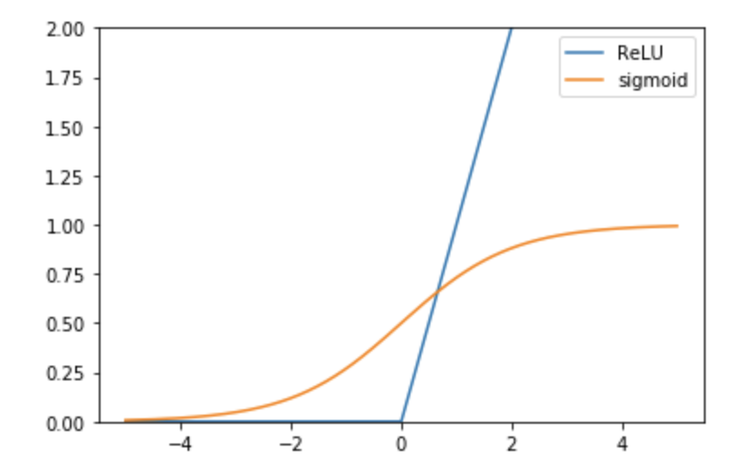

$\sigma(x) = (1 + e^{-x})^{-1}$, $\rho(x) = \max(0, x)$

---

# ReLU Derivatives

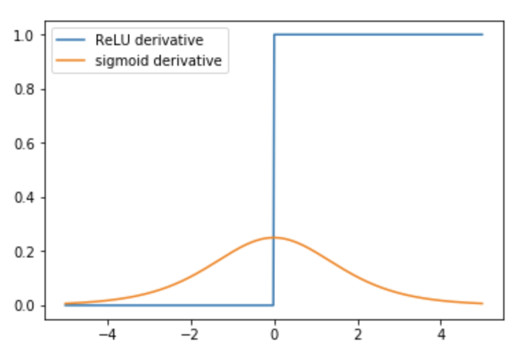

---

# Nonlinearity Properties

| property          | sigmoid          | ReLU              |
|-------------------|------------------|-------------------|
| derivatives       | infinite         | f': discontinuous |
|                   |                  | f'': zero         |
| monotonicity      | monotonic        | monotonic         |
| range             | $(0, 1)$         | $(0, \infty)$     |
| zero-derivative   | none             | $(-\infty, 0)$    |

---

# ReLU

- much faster to compute
- converges faster
- scale independent
- existence of zero-derivative regions causes "no deltas", units may "go dead"
- positive output only
- results in piecewise linear approximations to functions
- results in classifiers based on linear arrangements

---

# Max Pooling

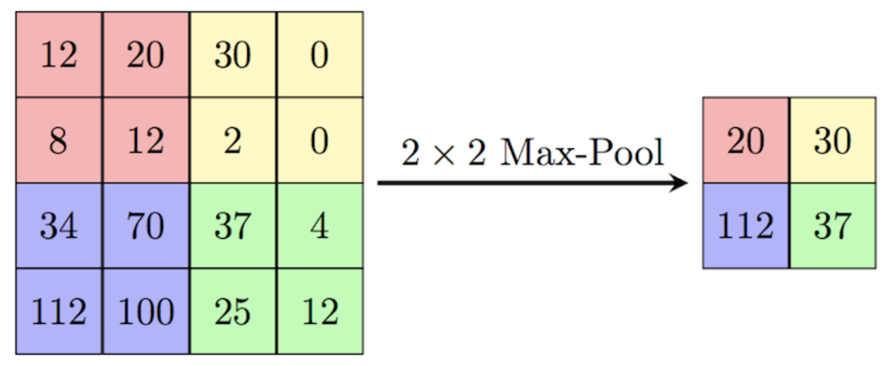

- replaces average pooling, reduces resolution
- performed per channel
- nonlinear operation, somewhat similar to morphological operations

---

# Local Response Normalization

$$ y = x \cdot (k + \alpha (K * |x|^\gamma) ^ \beta)^-1 $$

- Here, $*$ is a convolution operation.
- That is, we normalize the image with an average of the local response. 
- In Alexnet, $k=2$, K is a 5x5 pillbox, $\gamma=2$, $\beta=0.75$
- A simple variance normalization would use $k=0$, $\gamma=2$, and $\beta=0.5$

In later models, this is effectively replaced by batch normalization.

---

# Dropout

- randomly turn off units during training
- motivated by an approximation to an ensemble of networks
- intended to lead to better generalization from limited samples

---

# Data Augmentation

- generate additional training samples by modifying the original images
- long history in OCR
- for image training:
  - random geometric transformation
  - random distortions
  - random photometric transforms
  - addition of noise, distractors, masking

---

# FURTHER DEVELOPMENTS

---

# Batch Normalization

"Batch Normalization: Accelerating Deep Network Training by Reducing Internal Covariate Shift", S. Ioffe and C. Szegedy, 2015.

- attributes slower learning to "internal covariate shift"
- suggests that ideally, each layer should "whiten" the data
- instead normalizes mean and variance for each neuron
- normalization based on batch statistics (and running statistics)

---

# Inception

Szegedy, Christian, et al. "Rethinking the inception architecture for computer vision." Proceedings of the IEEE conference on computer vision and pattern recognition. 2016.

- very deep architecture built up from complex modules
- separable convolutions for large footprints
- "label smoothing"

---

# VGG Networks

Simonyan, Karen, and Andrew Zisserman. "Very deep convolutional networks for large-scale image recognition." arXiv preprint arXiv:1409.1556 (2014).

- very deep networks with fairly regular structure
- multiple convolutions + max pooling
- combined with batch normalization in later systems

---

# Residual Networks

He, Kaiming, et al. "Deep residual learning for image recognition." Proceedings of the IEEE conference on computer vision and pattern recognition. 2016.

- novel architecture composed of modules
- each module consists of convolutional layers
- the output of the convolutional layers is added to the input
- ReLU and batch normalization is used throughout

---

# LOCALIZATION

---

# Localization of Objects

- objects occur at different locations in scenes/images
- different strategies with recognizing objects:
  - global classification
  - moving/scanning window
  - region proposals (RCNN etc.)
  - learning dense markers / segmentation

---

# Global Classification

        def conv2d_block(d):
            return nn.Sequential(
                flex.Conv2d(d, 3, padding=1), flex.BatchNorm2d(), flex.ReLU(),
                flex.Conv2d(d, 3, padding=1), flex.BatchNorm2d(), flex.ReLU(),
                flex.MaxPool2d(),
            )

        nn.Sequential(
            *conv2d_block(64), *conv2d_block(128), *conv2d_block(256), 
            *conv2d_block(512), *conv2d_block(1024), *conv2d_block(2048),
            # we have a (None, 2048, 4, 4) batch at this point
            layers.Reshape(0, [1, 2, 3]),
            flex.Linear(4096), flex.BatchNorm(), nn.ReLU(),
            flex.Linear(4096), flex.BatchNorm(), nn.ReLU(),
            flex.Linear(1000)
        )

---

# Sliding Windows

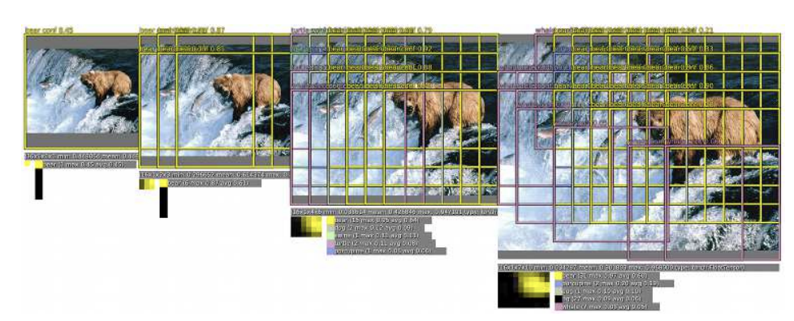

Sermanet, Pierre, et al. "Overfeat: Integrated recognition, localization and detection using convolutional networks." arXiv preprint arXiv:1312.6229 (2013).

---

# Region Proposal Network

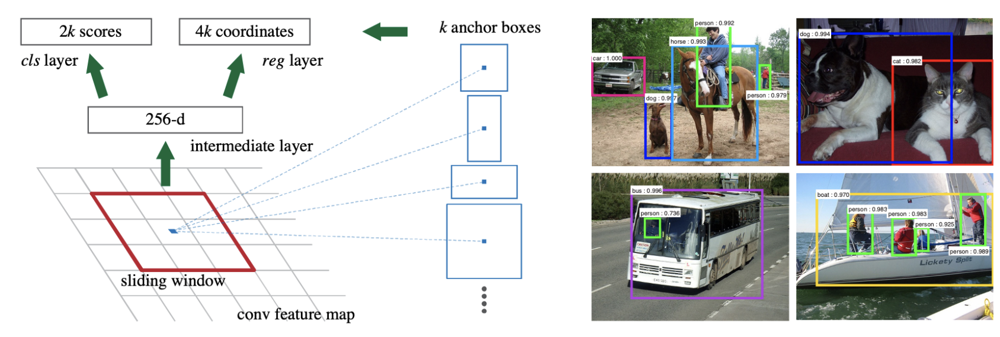

Ren, Shaoqing, et al. "Faster r-cnn: Towards real-time object detection with region proposal networks." Advances in neural information processing systems. 2015.

---

# APPLICATIONS TO OCR

---

# Character Recognition

- assuming you have a character segmentation
  - extract each character
  - feed to any of these architectures as if it were an object recognition problem

Goodfellow, Ian J., et al. "Multi-digit number recognition from street view imagery using deep convolutional neural networks." arXiv preprint arXiv:1312.6082 (2013).

- applies convolutional networks directly to digit recognition

---

# Word Recognition

- perform word localization using Faster RCNN
- perform whole word recognition as if it were a large object reconition problem

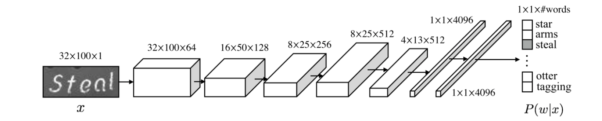

Jaderberg, Max, et al. "Deep structured output learning for unconstrained text recognition." arXiv preprint arXiv:1412.5903 (2014).

---

# Better Techniques

- above techniques are applications of computer vision localization
- Faster RCNN and similar techniques are ad hoc and limited
- often require pre-segmented text for training
- better approaches:
  - use markers for localizing/bounding text (later)
  - use sequence learning techniques and CTC for alignment and OCR learning

---

# Using Convolutional Networks for OCR

        nn.Sequential(
            # BDHW
            *convolutional_layers(),
            # BDHW, now reduce along the vertical
            layers.Fun(lambda x: x.sum(2)),
            # BDW
            layers.Conv1d(num_classes, 1)
        )

---

# Training Procedure for Convolutional Networks

- pass the input image (BDHW) through the model
- output is a sequence of vectors (BDW=BDL)
- perform CTC alignment between output sequence and text string
- compute the loss using the aligned output sequence
- backpropagate and update weights

---

# Viterbi Training

- ground truth: text string = sequence of classes
- ground truth `"ABC"` is replaced by regular expression `/_+A+_+B+_+C+_+/`
- network outputs $P(c|i)$, a probability of each class $c$ at each position $i$
- find the best possible alignment between network outputs and ground truth regex
- that alignment gives an output for each time step
- treat that alignment as if it were the ground truth and backpropagate
- this is an example of an EM algorithm

---

# CTC Training

- like Viterbi training, but instead of finding the best alignment uses an average alignment

Identical to traditional HMM training in speech recognition:

- Viterbi training = Viterbi training
- CTC training = forward-backward algorithm

---

# cctc2

        optimizer.zero_grad()
        output = model(input)
        aligned = cctc2.align(output, target)
        loss = mse_loss(aligned, output)
        loss.backward()
        optimizer.step()

- with the `cctc2` library, we can make the alignment explicit

---

# CTC in PyTorch

        optimizer.zero_grad()
        output = model(input)
        loss = ctc_loss(output, target)
        loss.backward()
        optimizer.step()

- in PyTorch, CTC is implemented as a loss function
- `CTCLoss` in PyTorch obscures what's going on
- all you get is the loss output, not the EM alignment
- sequences are packed in a special way into batches

---

# Word / Text Line Recognition

        model = nn.Sequential(
            *convolutional_layers(),
            layers.Fun(lambda x: x.sum(2)),
            layers.Conv1d(num_classes, 1)
        )
        ...
        for input, target in training_dl:
            optimizer.zero_grad()
            output = model(input)
            loss = ctc_loss(output, target)
            loss.backward()
            optimizer.step()       

---

# VGG-Like Model

        nn.Sequential(
            layers.Input("BDHW", sizes=[None, 1, None, None]),
            *conv2mp(100, 3, 2, repeat=2),
            *conv2mp(200, 3, 2, repeat=2),
            *conv2mp(300, 3, 2, repeat=2),
            *conv2d(400, 3, repeat=2),
            *project_and_conv1d(800, noutput)
        )

---

# Resnet-Block

        def ResnetBlock(d, r=3):
            return nn.Sequential(
                Additive(
                    nn.Identity(),
                    nn.Sequential(
                        nn.Conv2d(d, d, r, padding=r//2), nn.BatchNorm2d(d), nn.ReLU(),
                        nn.Conv2d(d, d, r, padding=r//2), nn.BatchNorm2d(d)
                    ),
                nn.MaxPool2d(2)
            )
        
        def resnet_blocks(n, d, r=3):
            return [ResnetBlock(d, r) for _ in range(n)]

- NB: we can easily define Resnet etc. in an object-oriented fashion

---

# Resnet-like Model

        nn.Sequential(
            layers.Input("BDHW", sizes=[None, 1, None, None]),
            *conv2mp(64, 3, (2, 1)),
            *resnet_blocks(5, 64), *conv2mp(128, 3, (2, 1)),
            *resnet_blocks(5, 128), *conv2mp(256, 3, 2),
            *resnet_blocks(5, 256), *conv2d(256, 3),
            *project_and_conv1d(800, noutput)
        )

---

# Footprints

- even with projection/1D convolution, a character is first recognized in 2D by the 2D convolutional network
- character recognition with 2D convolutional networks really a kind of deformable template matching
- in order to recognize a character, each pixel at the output of the 2D convolutional network needs to have a footprint large enough to cover the character to be recognized
- footprint calculation:
  - 3x3 convolution, three maxpool operations = 24x24 footprint

FIXME add figure

---

# Problems with VGG/Resnet+Conv1d

Problem:
- reduces output to H/8, W/8
- CTC alignment needs two pixels for each character
- these models has trouble with narrow characters

Solutions:
- use fractional max pooling
- use upscaling
- use transposed convolutions

---

# Less Downscaling using `FractionalMaxPool2d`

        def conv2fmp(d, r, ratio=(0.7, 0.85)):
            return [
                flex.Conv2d(d, r, padding=r//2), flex.BatchNorm2d(), nn.ReLU(),
                nn.FractionalMaxPool2d(3, ratio)
            ]

        nn.Sequential(
            layers.Input("BDHW", sizes=[None, 1, None, None]),
            *conv2fmp(50, 3), *conv2fmp(100, 3), *conv2fmp(150, 3), *conv2fmp(200, 3),
            layers.Fun("lambda x: x.sum(2)"), # BDHW -> BDW
            *project_and_conv1d(800, noutput)
        )

- permits more max pooling steps without making image too small
- can be performed anisotropically
- necessary non-uniform spacing may have additional benefits

---

# Upscaling using `torch.nn.functional.interpolate`

        nn.Sequential(
            layers.Input("BDHW", sizes=[None, 1, None, None]),
            *conv2mp(50, 3), *conv2mp(100, 3), *conv2mp(150, 3), *conv2mp(200, 3),
            layers.Fun("lambda x: x.interpolate(x, scale=4))
            *project_and_conv1d(800, noutput)
        )
- `interpolate` simply scales an image back up and can be propagated through
- `MaxPool2d ... block ... interpolate` is a simple multiscale analysis
- can be combined with loss functions at each level

---

# Upscaling using `ConvTranspose1d`

        nn.Sequential(
            layers.Input("BDHW", sizes=[None, 1, None, None]),
            *conv2mp(50, 3), *conv2mp(100, 3), *conv2mp(150, 3), *conv2mp(200, 3),
            layers.Fun("lambda x: x.sum(2)"), # BDHW -> BDW
            flex.ConvTranspose1d(800, 1, stride=2), # <-- undo too tight spacing
            *project_and_conv1d(800, noutput)
        )

- `ConvTranspose2d` fills in higher resolutions with "templates"
- commonly used in image segmentation and superresolution

---

# How well do these work?

- Works for word or text line recognition.
- All these models only require that characters are arranged left to right.
- Input images can be rotated up to around 30 degrees and scaled.
- Input images can be grayscale.
- Great for scene text and degraded documents.

But:
- You pay a price for translation/rotation/scale robustness: lower performance.

---

# SEQUENCE MODELING AND RECURRENT NETWORKS

---

# Recurrent Networks

Consider a sequence of samples: $x_t$ for $t \in \{0...n\}$
Want to produce an output sequence $y_t$

Convolutional/TDNN models: 

$$y_t = f(x_{t},...,x_{t-k})$$

Recurrent Models:

$$y_t = f(x_t, y_{t-1})$$

---

# Simple Recurrent Model

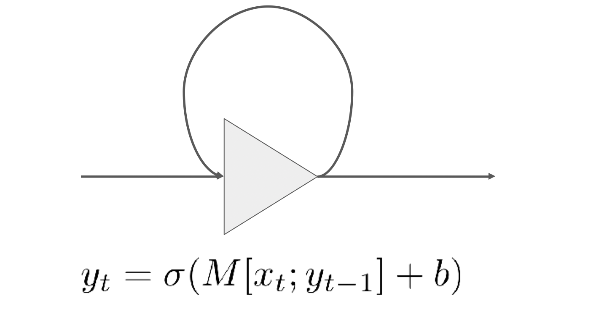

---

# Unrolling and Vanishing Gradient

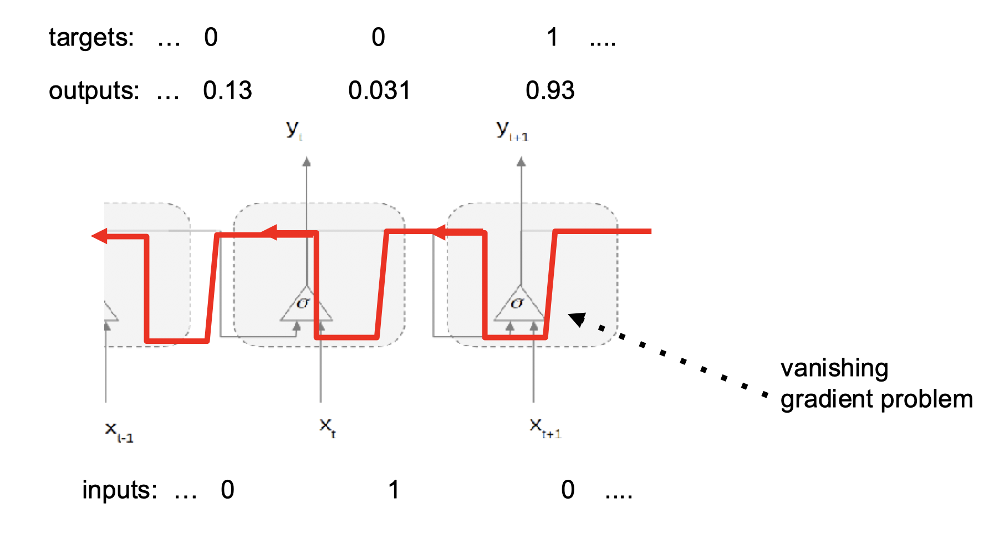

---

# LSTM as Memory Cell

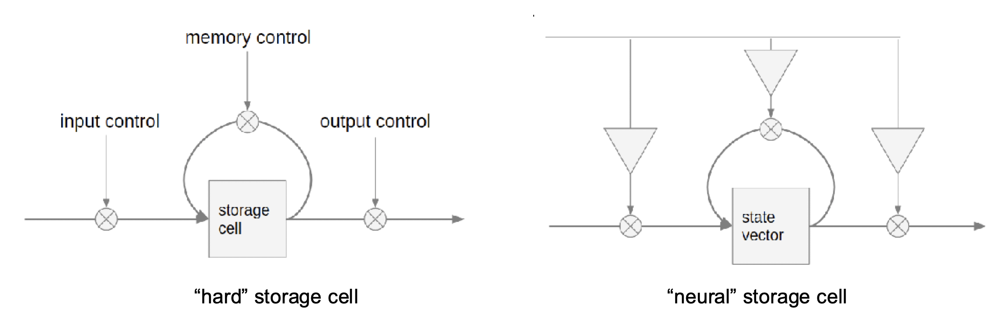

---

# LSTM Networks

LSTMs are a particular form of recurrent neural network.

Three gates (using sigmoids):

- forget gate: $f_t = L_f(x_t, y_{t-1})$
- input gate: $i_t = L_i(x_t, y_{t-1})$
- output gate: $o_t = L_o(x_t, y_{t-1})$

Output computation ($L_s$ uses $\tanh$):

- state: $s_t = f_t s_{t-1} + i_t L_s(x_t, y_{t-1})$
- output: $y_t = o_t s_t$

Here, $L_f$, $L_i$, $L_o$ and $L_s$ are full linear layers with nonlinearities.

---

# Bidirectional LSTM

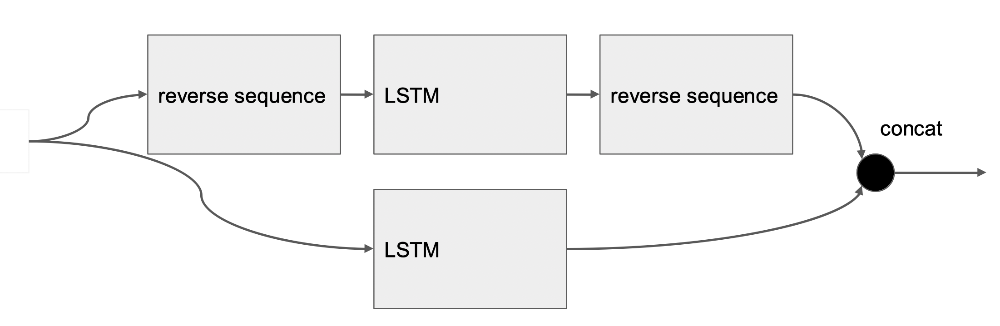

---

# LSTM for OCR (simple)

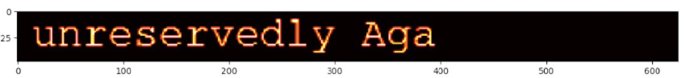

Simple approach to OCR with LSTM:
- assume a W x H x 1 input image
- consider this a sequence of W vectors of dimension H
- use these vectors as input to a (BD)LSTM
- perform CTC alignment

---

# LSTM for OCR (simple)

        model = nn.Sequential(
            layers.Input("BDHW", sizes=[None, 1, 48, None]),
            layers.Reshape(0, [1, 2], 3),
            layers.BDL_LSTM(100),
            layers.Reorder("BDL", "LBD")
        )
        ...
        for input, target in training_dl:
            optimizer.zero_grad()
            output = model(input)
            loss = ctc_loss(output, target)
            loss.backward()
            optimizer.step()

---

# LSTM for OCR (simple)

- does not work for unconstrained inputs
- works well for size and position normalized inputs
- works much like an HMM model for OCR

---

# Size/Position Normalization for LSTM OCR

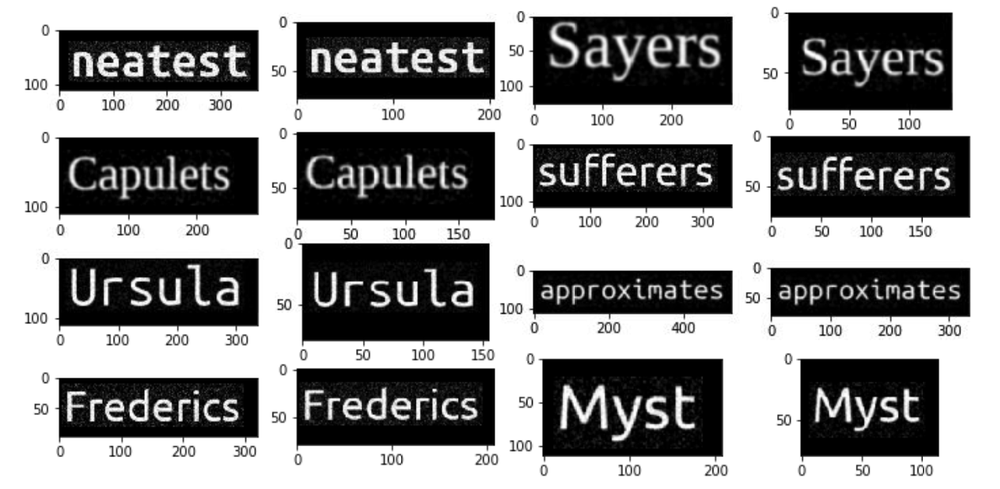

---

# Size/Position Normalization

For binary word images:

- pick a target image height $h$
- find the centroid $\mu$ and the covariance matrix $\Sigma$ of the pixels
- compute an affine transform that:
  - moves $\mu_y$ to $h/2$
  - scales $\Sigma_{yy}^{1/2}$ to $h/2$

More complex:
- grayscale images $\rightarrow$ simple thresholding first
- long lines $\rightarrow$ compute $\mu_y$ and $\Sigma_{yy}$ in overlapping windows for each $x$

---

# Word/Line Recognition with Size Normalization

Word image normalization can go into the dataloader's data transformations (or be precomputed):

        transforms = [
            lambda image: size_normalize(image),
            lambda transcript: encode_text(transcript)
        ]
        training_dl = DataLoader(WebDataset(..., transforms=transforms))

        for input, target in training_dl:
            optimizer.zero_grad()
            output = lstm_model(input)
            loss = ctc_loss(output, target)
            loss.backward()
            optimizer.step()

---

# Combining Convolutional Nets with LSTM

    model = nn.Sequential(
        *convnet_layers(),
        layers.Fun("lambda x: x.sum(2)"), # BDHW -> BDW
        layers.Reorder("BDL", "LBD"),
        flex.LSTM(d, bidirectional=True, num_layers=num_layers),
        layers.Reorder("LBD", "BDL"),
        flex.Conv1d(noutput, 1),
        layers.Reorder("BDL", "BLD")
    )

- we can easily combine convolutional layers with LSTM
- here is the general scheme; it's complicated many by different data layouts

---

# Projection Options

Going from "BDHW" image to "BDL" sequence, we have several options:

| projection            | properties                 |
|-----------------------|----------------------------|
| x.sum(2)              | position/scale independent |
| x.max(2)              |                            |
| Reshape(0, [1, 2], 3) | position dependent         |
| BDHW_to_BDL_LSTM      | trainable reduction        |

---

# Reduction with LSTM

Reduction with LSTM is similar to seq2seq models: it reduces an entire sequence (pixel rows or columns in this case) to a final state vector.

        b, d, h, w = img.size()
        seq = reorder(img, "BDHW", "WBHD").view(w, b*h, d)
        out, (_, final) = lstm(seq)
        reduced = reorder(final.view(b, h, noutput), "BHD", "BDH")

---

# Chinese Menu Style Text Recognition

- **input**: normalized, word normalized, line normalized
- **convolutional** layers: VGG-like, Resnet-like, FMP, U-net-like
- **scaling layers**: none, interpolation, transposed convolution
- **reduction**: sum, max, concat/reshape, LSTM
- **sequence modeling**: none, LSTM

---

# What should you use?

Some rules of thumbs:

- sum/max/LSTM reduction with unnormalized, concat/LSTM with normalized
- normalized + convolution + LSTM: good for printed Western OCR
- unnormalized + convolution + LSTM: scene text, handwriting
- unnormalized + convolution: faster scene text, lower performance

Large literature trying many different combinations of these.

---

# Which is "best"?

Results depend on many factors:

- character set: #classes, fonts, etc.
- dataset: noise/degradation, distortions, etc.
- training set size and variability
- available training and inference hardware
- precise architecture choice
- training schedule and method

There is no single "best" method.

Any one method can be "best" for some circumstances

---

# LOCALIZATION

---

# OCR Training Data

OCR training data usually consists of:

- an image of text
- a transcription of the text

We are usually not given:

- character bounding boxes
- word bounding boxes (when recognizing text lines)
- page segmentation (when recognizing whole pages)

---

# EM Algorithms

Expectation-Maximization is a general approach to learning when some variable we need for recognition is missing from the training data.

For OCR, the missing information is the _segmentation_ (e.g., character locations.

EM approach:
- make a first guess at the segmentation
- recognize assuming the segmentation is correct
- update the segmentation using the recognition output
- repeat

---

# CTC as an EM Algorithm

- perform scanning recognition (e.g. with LSTM)
- perform Viterbi/CTC alignment to find the best locations for each character
- use those locations as if they were ground truth
- compute cross entroy / MSE loss and backpropagate

CTC gives us horizontal positions of characters but no vertical locations.

What if we want XY positions for each character? Bounding boxes?

---

# Brute Force XY Character Positions

- input: unnormalized word images
- get X positions from CTC algorithm / DL output
- formally assign Y positions to characters as $\mu_y$ of the word image
- train a convolutional neural network using $(x_{CTC}, \mu_y)$ as the location for each character

---

# EM Algorithm for XY Character Positions

- input: unnormalized word images
- have a 2D convolutional network that outputs the probability of the presence of a character at each pixels $(x, y)$
- reduce the 2D probability map to a 1D probability sequence
- perform CTC on the 1D sequence as before

Probability Reduction:

        l = model(images).softmax(1)
        r1 = l[:,1:,:,:].max(2)[0] # BDW
        r0 = (1-r1.max(1)[0])[:,None,:] # B1W
        z = torch.cat([r0, r1], dim=1).log().softmax(1)

---

# RCNN-like Algorithm

- you can implement region proposal algorithms directly for character bounding boxes
- the problem is complicated by the fact that there are frequently multiple instances of each character
- a direct implementation does not take advantage of the known left-to-right ordering of the transcript but simply treats transcripts as bags of characters

---

# Segmentation by Backpropagation / Masking

Several techniques in the literature have been developed to determine which regions in the input are responsible for a given output class:

- for each output location of a CTC-trained model, compute the derivative of the output with respect to the input pixels
- scan a mask across the input image and determine which mask locations affect which character classification

---

# LAYOUT MODELS

---

# Layout Analysis

Goals of document layout analysis:

- identify text/image regions on pages
- find text lines
- find words within text lines
- determine reading order

---

FIXME references and sample images

---

# RCNN for Layout Analysis

- RCNN has been used for word bounding boxes in scene text
- likely does not work well for whole page segmentation
  - regions often not exactly axis-aligned rectangles
  - regions wildly differ in scale and shape
  - region hypotheses likely difficult to regress from moving windows

FIXME reference

---

# Layout Analysis as Semantic Segmentation

- semantic image segmentation = image-to-image transformation
- each image is classified into one of several different semantic classes
- possible pixel classes for layout analysis:
  - text / image / table / figure / background
  - baseline / background
  - centerline / background
  - text / image / text line separator / column separator

---

# What do we label?

Possibilities:

- foreground pixels only
- all pixels in a rectangle / region
- leave it up to the algorithm

Very different results:

- foreground/algorithm = we don't know which pixels belong together
- all pixels in a region = group pixels together by connected components
- labeling / segmentation closely linked to intended post-processing for region extraction

---

# Page Level Segmentation

Page level segmentation divides images into text regions, image regions, and background.

- precise pixel-level segmentations are not usually needed
- segmentations can be computed at a lower level of resolution
- simple properties like text/image/background can be computed based on local texture / statistics
- separating adjacent text columns or images may be difficult, since background gaps may be narrow

Different uses:

- simply mask out non-text regions for further processing (basic binary map sufficient)
- extract text regions via connected components (requires higher quality segmentation)

---

# Simple Approach

Word segmentation:

- assume training data consists of page images and word bounding boxes
- create a binary target that is 1 inside word bounding boxes and 0 elsewhere
- learn an image-to-image model predicting the binary map from the input document image

Problem:

- word bounding boxes are often overlapping
- how do we turn the resulting binary image into something we can feed to a word recognizer?

---

# Centerline / Baseline Approach

Word/line segmentation:

- assume training data consists of page images and word/line bounding boxes
- create a binary image that marks either the center line or the baseline of each bounding box
- learn an image-to-image model predicting the centerline/baseline map from the input document image:

Properties:

- works better than the simple approach
- still need to use non-DL mechanisms to find the word/line bounding boxes from the seeds

---

# Marker Plus Separator Approach

Word/line segmentation:

- assume training data consists of page images and word/line bounding boxes
- three output classes:
  - background
  - marker (center of bounding box)
  - boundary (outline of bounding box)
- train image-to-image segmentation model to output all three classes
- recover word/line images via marker morphology

Properties:

- functions like RCNN, in that it finds both the location and the size of object instances (words/lines)
- simpler to understand/tune: we can see the marker/boundary proposals

---

FIXME examples from marker-plus-separator approach

---

# Footprint and Global Context for Page Segmentation

---

# Semi-Supervised and Weakly Supervised Approaches

---

# NEURAL TRANSDUCERS

---
